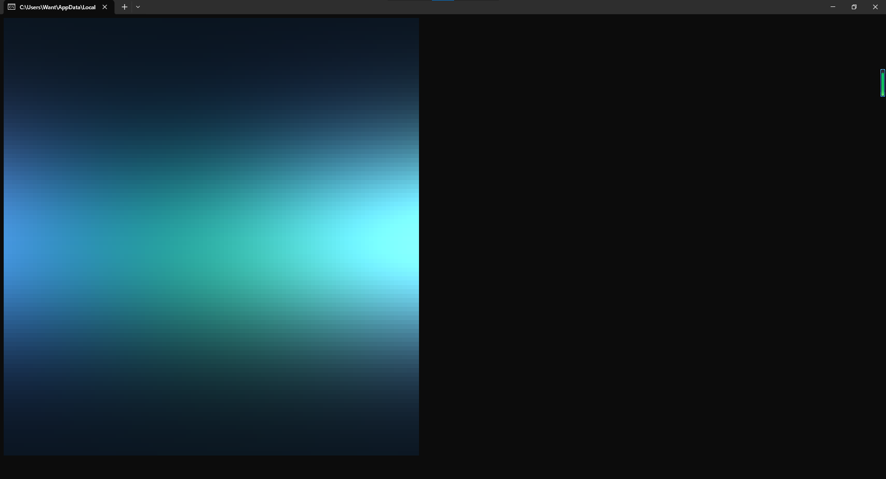
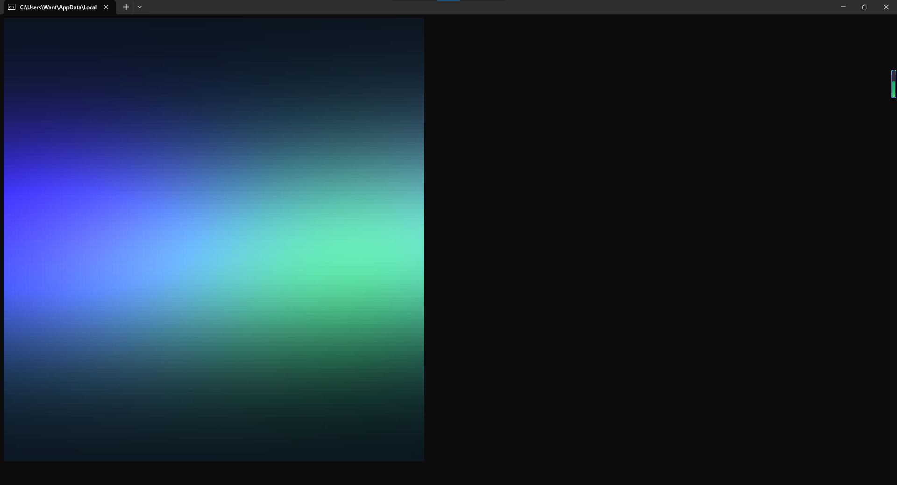
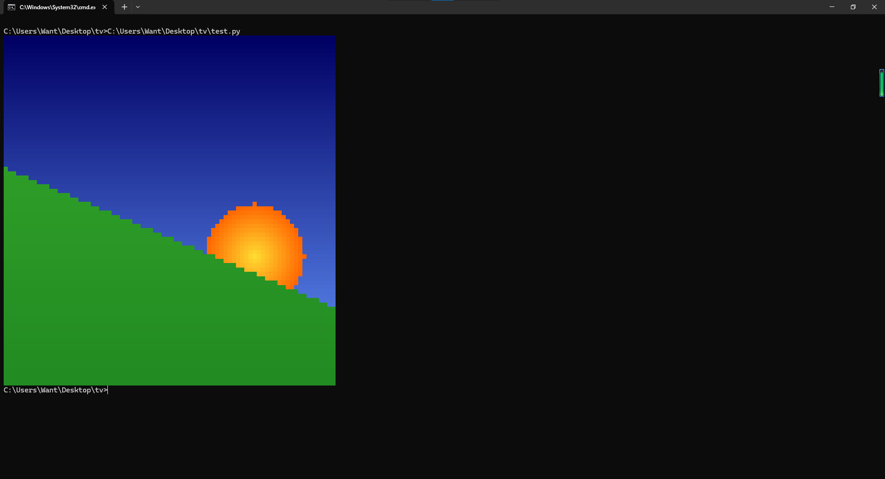

# Terminal Viewer
[中](README_zh.md) | [En](README_en.md)

Terminal Viewer 是一个Python模块，用于在终端显示特定格式的图像

> 当前版本`v0.0.1`已**不是最新**

## 怎样工作的？

Terminal Viewer 利用 ANSI 转义序列，在终端中对单个字符 `▄`（下半块字符）同时设置**前景色**和**背景色**，从而实现一个字符显示两个独立像素的效果，给 `▄` 设置不同的前景色和背景色再组合起来就是一幅完整的图片了


## 如何使用？
- 安装依赖
```text
pip install -r requirements.txt
```

- 查看图片

```python
from tv import * #导入函数
show_photo(load("your_photo.pic")) #加载并查看，格式必须是图片，否则会报错
```
- 播放视频

```python
from tv import * #导入函数
play_video(load("your_video.vid")) #加载并播放，格式必须是视频，否则会报错
#也可以指定帧率： play_video(load("your_video.vid")，fps=60)
```

## 函数

| 函数名 | 参数 |说明| 返回值的类型 |
|:------:|:------:|:------:|:------:|
|**transform**|ur:**int**, ug:**int**, ub:**int**, lr:**int**, lg:**int**, lb:**int**, char:**str** = **_char**|`ur/g/b` 对应**上半块**的rgb值，`lr/g/b` 对应**下半块**的rgb值,返回**一个**设置了前景色和背景色的半块字符(上下两个像素)|**str**|
|**parse**|lst:**tuple[tuple[tuple[int,int,int,int,int,int]]]**, char:**str** = **_char**|`lst`对应**单帧**图像，返回一张处理好的图像(字符串组成，直接输出就能看到)|**str**|
|**play_video**|lst:**tuple[tuple[tuple[tuple[int,int,int,int,int,int]]]]**, char:**str** = **_char**, fps:**int** = **30**|`lst`对应**多帧图像**，`fps`是帧率，默认30fps，无返回|**NoneType**|
|**show_photo**|lst:**tuple[tuple[tuple[int,int,int,int,int,int]]]**, char:**str** = **_char**|同`parse`函数|**NoneType**|
|**save**|lst:**tuple[tuple[tuple[int,int,int,int,int,int]]]** \| **tuple[tuple[tuple[tuple[int,int,int,int,int,int]]]]**,path:**str**,level:**int** = **3**|将`lst`序列化并`level`级压缩后保存到`path`|**NoneType**|
|**load**|path:**str**|从`path`打开文件后校验，如果校验成功，返回反序列化后的解压数据，否则报错(不要加载不可信来源的数据)|**tuple[tuple[tuple[int,int,int,int,int,int]]]** \| **tuple[tuple[tuple[tuple[int,int,int,int,int,int]]]]**|
|**myprint**|text:**str**|将`text`写入缓冲区后立即刷新|**NoneType**|

## 图像数据从哪里来？

- 你可以将[`tv.py`](tv.py)和[`prompt_zh.md`](prompt_zh.md)喂给ai并描述你想要生成的图片/视频，例如：

```text
生成一个太阳从山坡上升起的图片，自动保存文件到当前目录，不预览，后缀名.pic,512*512像素
```

- 或者：

```text
生成一个极光视频，100*50，60fps，60秒，自动保存文件到当前目录，不预览，压缩等级设为22，内存占用问题不用管
```

> 只不过ai给你的数据效果可能一言难尽...

- 你也可以自己写一个图像处理脚本，将图片转成[`tv.py`](tv.py)需要的格式，这样效果就好很多了

## 效果

- 视频




---

- 图片



# License

[Mozilla Public License, v. 2.0.](LICENSE)